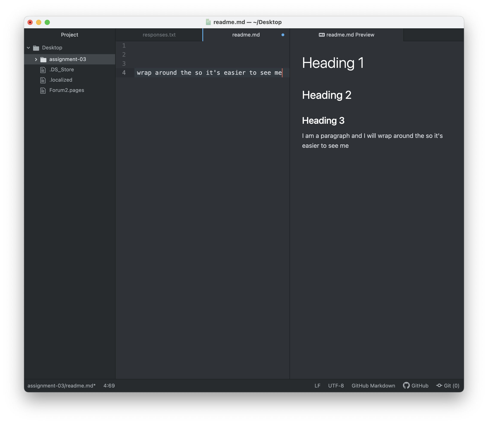

# Heading 1
## Heading 2
### Heading 3
I am a paragraph and I will wrap around the so it's easier to see me.

That's better!

[Missoula County Food Service Application](https://www.missoulacounty.us/government/health/health-department/food-lodging-body-art-child-care/food-services/retail-food-service)

 [My Responses](./responses.txt)

So far in this class, I have learned:

1) How to write in Markdown language.

2) The physical components that make the internet possible.

3) The origin of the internet and the world wide web, and the difference between the two.
