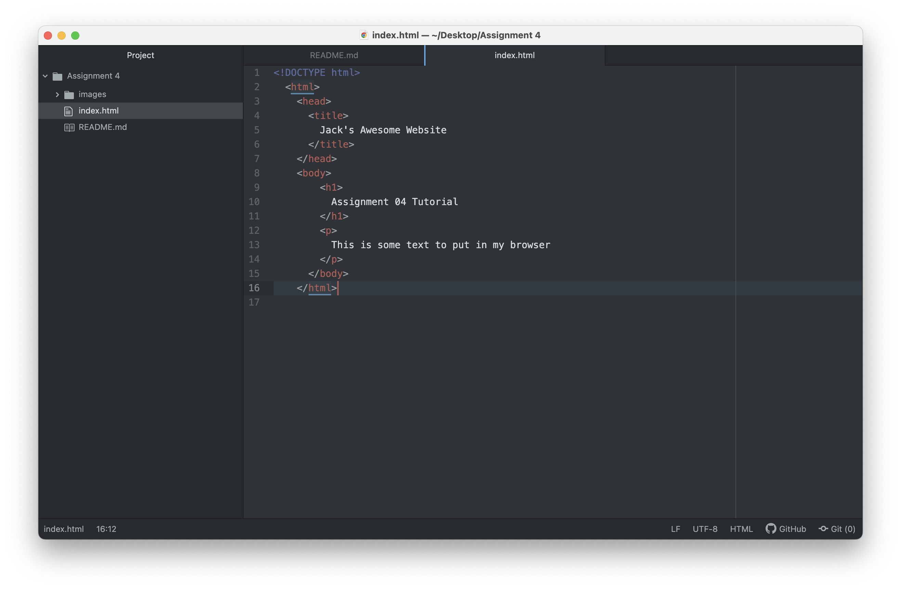

A web browser translates HTML language into a visual display of text, images, video, links, etc for the user to interface with. I currently use Google Chrome, I recently switched from Safari which came standard on my Macbook. In the past, I have also used Mozilla Firefox, and actually, remember Opera from when I was a kid.

