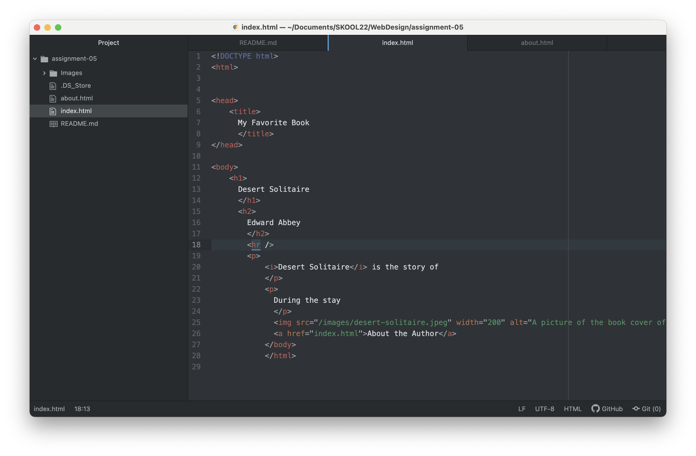

I visited askjeeves.com on the Wayback machine. I was looking at a screenshot from February in the year 2000. I thought it would be funny to look at this site because I remember visiting it when I was young. The website has rebranded as Ask.com and now has a different format. The new website design is more like a blog, with questions and topics suggested from the homepage. There is a dropdown menu on the left side with categories to explore. Ask Jeeves has changed a lot since its inception, but it seems they made a decent effort to stay with the times!

