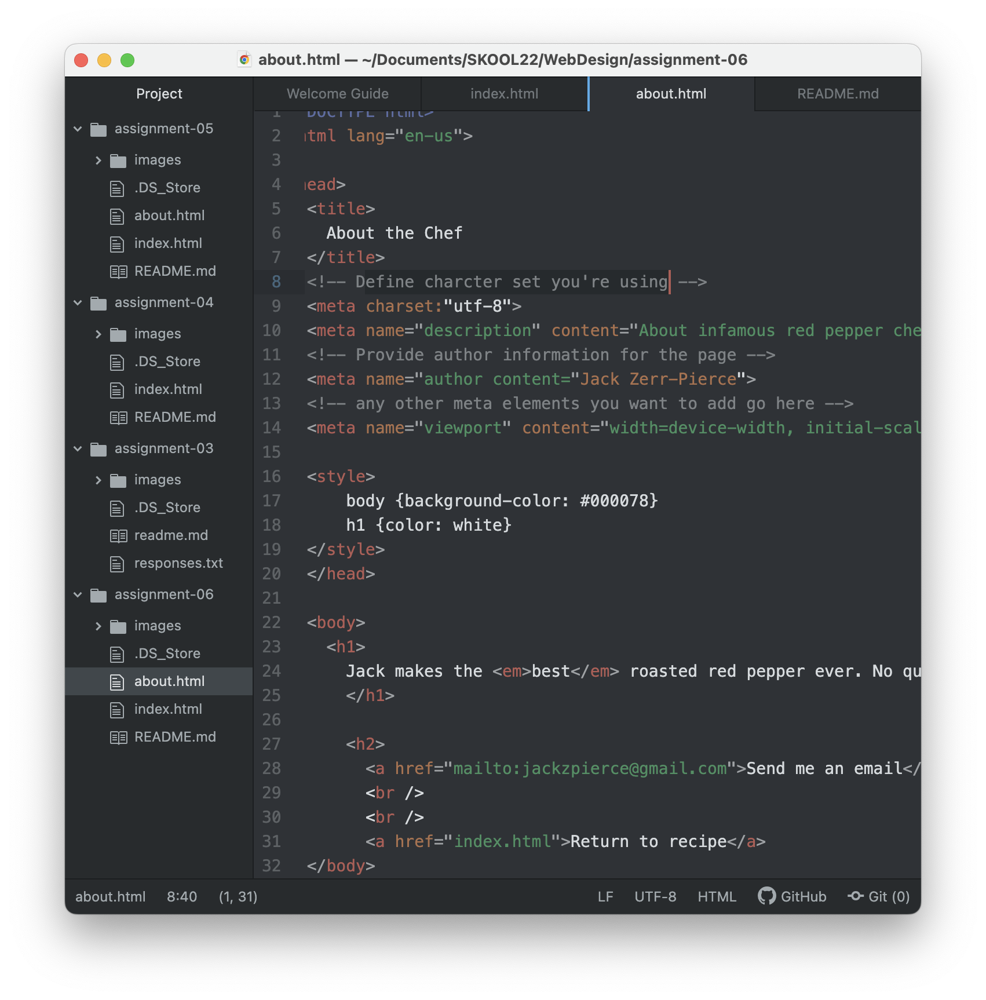

	Structural markup is code that provides the organization or structure of a web page. This information may be headings, paragraphs, titles, etc. Semantic markup is additional code that helps the viewer interpret the webpage. Semantic markup includes bolding and italicizing words for emphasis, quotes, block quotes, and definitions. Using structural and semantic markup elements together will provide the most effective web pages.

  
