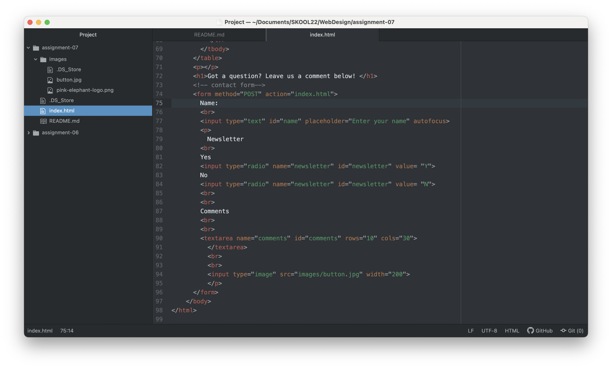

I recently used a form to submit my application for student loan forgiveness! Because the form required sensitive information, the form used protective masking of the digits of SSN numbers. The same type of protection is used for passwords. Although I wonder if they only protect someone from reading the numbers over your shoulder? I feel like if you had a computer virus that read keystrokes, it would not matter if the digits of your password or SSN were obscured into dots. I also bought some products online recently, another everyday use of forms on the website. The purpose of website forms is to collect data from the user to initiate communication or transaction. 

