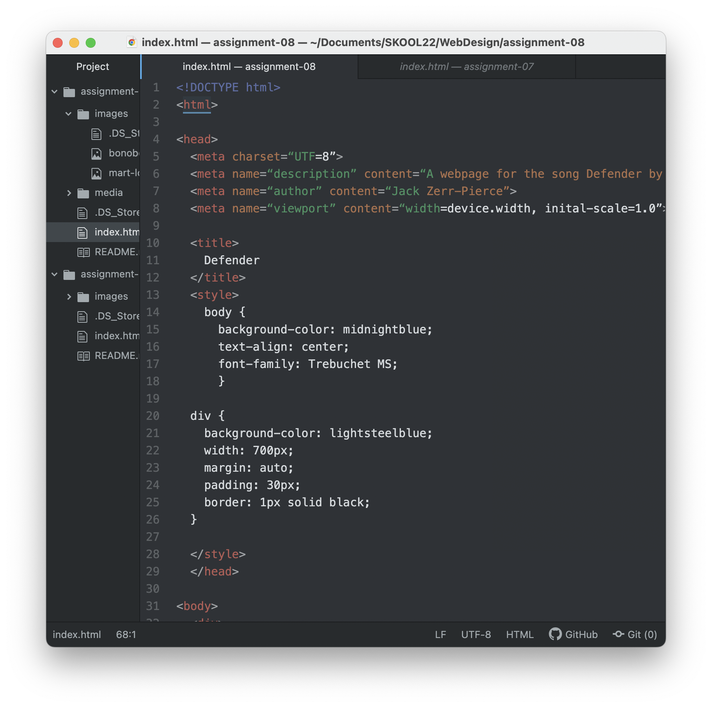

An affordance is a set of possible actions for an object. Digital affordances are learned through common use of symbols, like the power button logo. Another good example is the image of a cog, that most of us are aware represents settings. Clicking on the cog affords the user a way to navigate the settings of a browser, app, or website. We learn about affordances through interacting with them. It is also import to make sure the user perceives the affordances that the web developer is offering them to make web sites most effective.

The advantage of using a third-party hosting site is that it is ideal for video and audio files. You will be able to host large, high-quality versions of files that are not ideal for self-hosting. These third-party sites will also enable easy encoding and provide good compatibility for users. The disadvantages are that sometimes content can be removed if it contains a song or video that is unlicensed. It can also cost a monthly subscription to use.  

