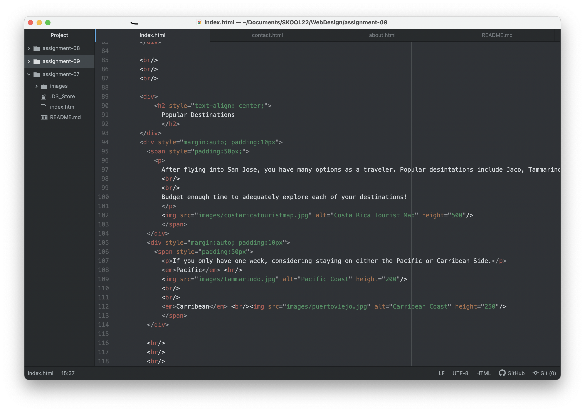

So far, what I like about HTML is how once you learn how to create an element you can use the same code in a new project. The knowledge builds on itself each week and the process becomes easier. I also like that just like learning a new language, elements of code can be found in our online resources or on the web. Through repetition, these phrases of code become second nature. I am excited to learn more decorative aspects of coding because I am a very visual person.

