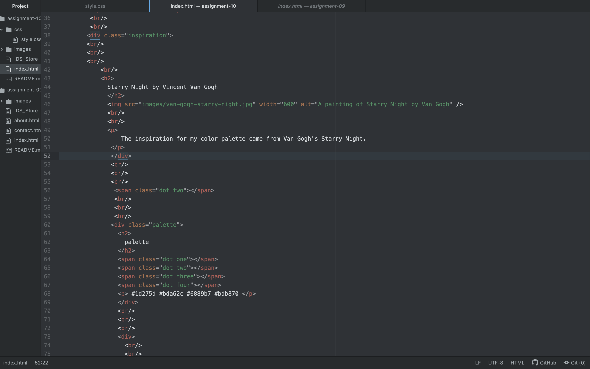

The selector types are ways to target specific elements of a webpage vs. all elements. The universal selector applies to every element on the page. This contrasts to element selectors which creates rules for certain elements of the page, like headings for example. Class selectors are similar to element selectors in that they can provide rules for multiple parts of the page, and can be used to style elements. ID selectors can only be used to style one element that is unique from the rest on a webpage.

I took your inspiration to take my color palette from a famous work of art. I chose Van Gogh's Starry night, because I find the colors in the image soothing.

The challenge I faced was figuring out the code for the colors I wanted. I solved this problem by brining my image into Photoshop, and using the eyedropper tool to sample the colors I wanted. I copied the color codes and pasted them into the code for my website! I was very satisfied with this method because I was able to sample the exact color I wanted, and I will probably use it again in the future. 

