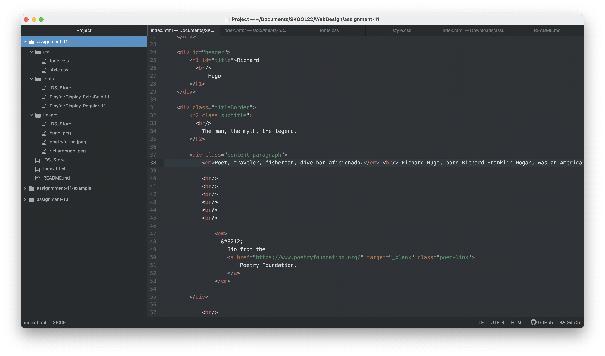

Typography is “the style and appearance of printed matter,” or “the art or procedure of arranging type.” Our lesson on typography this week mentioned that perfect typography is more science than art. In contrast, the other quote said that it is more of an art than engineering. This is interesting because both sentiments can be true. Artists will definitely have a leg up when it comes to typography, but the equilateral rule will make sense to the more analytical mind. At the end of the day, typography is how we present the text in our design work, and it is crucial to leave the reader with a positive experience of our content.

Fallback fonts, sometimes called a font stack are important because they are a backup in case primary fonts aren’t able to display. It is also important to choose a fallback font that is not too different or jarring from the primary. The fallback font should be as similar to the primary font as possible.

System fonts are the ones that come standard with your computer. These may vary by manufacturer, so certain fonts on Windows will not appear the same on a Mac. System fonts are not always set up for the web, so they must be exported as images if they are to be used on a website.

Web fonts are hosted on a web server so that they don’t have to be on your device to appear properly. More than half of web pages use web fonts.

Web-safe fonts are fonts families that are found on both Mac and Windows computers. These are common fonts, that web developers use for their wide compatibility. These are common fonts that we see a lot, like Arial, Georgia, and Times New Roman. The main advantage is the lack of loading times, and as mentioned before, the compatibility across platforms.

