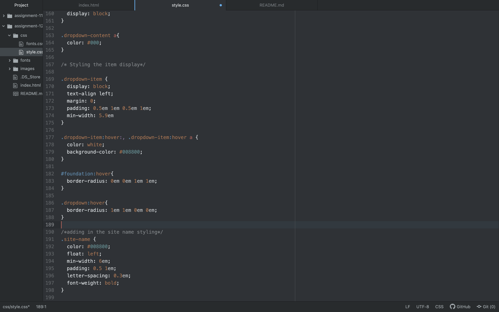

The padding creates space between the content in an element and the edge of the element. The padding creates a border that is more aesthetically pleasing.

Margin is the space between an element and the other elements on the page.

The border is the edge of an element, the size, and color of which are crucial to making the content stand out to the reader.

Using these three components together is the best way to create eye-catching web pages.

This week's assignment went well, except I could not seem to figure out how to align my header navigation bar to the right side. I still think it looks pretty good aligned to the left, but I went back through the code and compared it to the example and could not find my error. This was my biggest challenge, but I came to like the way my page turned out anyway.

